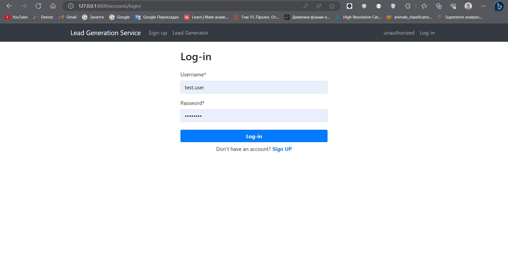
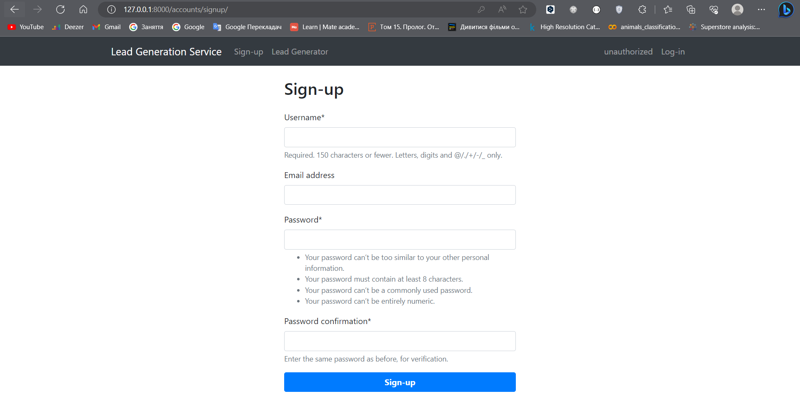
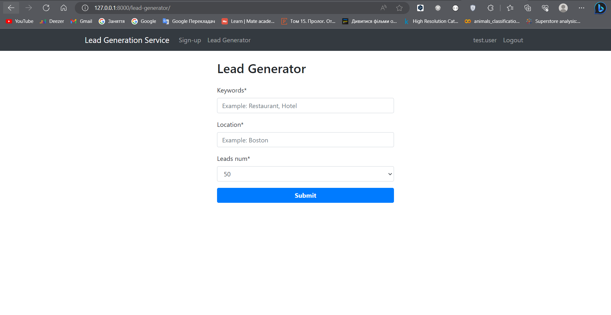

# Lead Generation Service 

Web interface using Django for the Lead Generation Service

## Installation
Python3 must be already installed

1. Clone project and create virtual environment
```shell
git clone https://github.com/arsenmakovei/lead-generator-web.git
cd lead_generator_service
python -m venv venv
Windows: venv\Scripts\activate
Linux, Unix: source venv/bin/activate
pip install -r requirements.txt
```

2. Create .env file and set environment variables

```shell
DJANGO_SECRET_KEY=<your Django secret key>
POSTGRES_HOST=<your Postgres db host>
POSTGRES_DB=<your Postgres db name>
POSTGRES_USER=<your Postgres db user>
POSTGRES_PASSWORD=<your Postgres db password>
```

3. Make migrations and run server
```shell
python manage.py migrate
python manage.py runserver
```

## Run with Docker

Docker should be installed

```shell
docker-compose build
docker-compose up
```

## Demo

Log-in page:


Sign-up page:


Lead Generator page:
